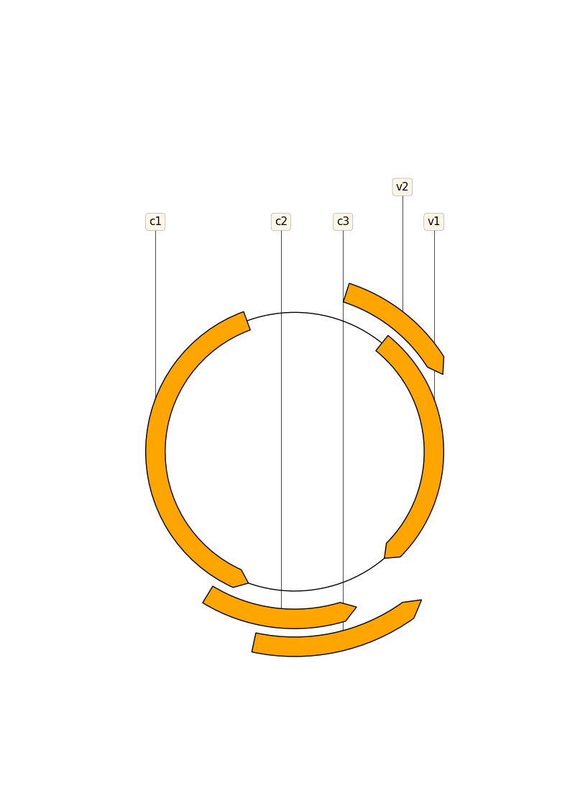

# Gagan Bhat ACM Research Coding Challenge Solution

## Result

Simple visualization of Tomato curly stunt virus from provided Genbank. 

I used a paper written by Dr. Zulkower and Dr. Rosser on a python package they developed to represent genes using Biopython internally. 

I specified the source, color mapping and required feature properties to make it easy to read. 

Please let me know if I can improvise or provide more information on the image. 

## Sources

Zulkower, V., & Rosser, S. (2020). DNA Features Viewer, a sequence annotations formatting and plotting library for Python. Cold Spring Harbor Laboratory. https://doi.org/10.1101/2020.01.09.900589

